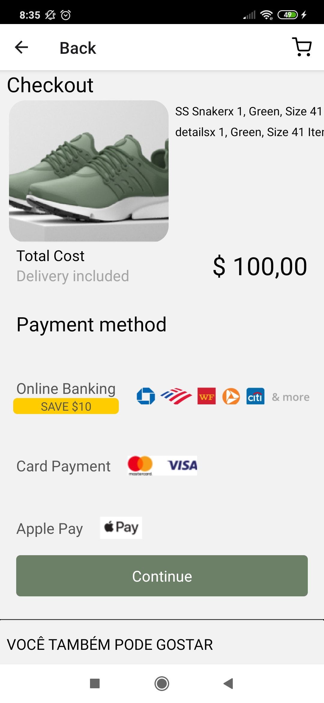

# TRUSTLY TEST

Projeto processo seletivo Trustly Test

Este projeto utiliza o [Expo](https://expo.io/). A versão do `expo-cli` usado foi a `3.24.2`
---
# 📱 App
## App Desenvolvida em:
    React Native
---
## Dependências: 

    @react-native-community/masked-view,
    @react-navigation/native,
    expo-font,
    react-native-gesture-handler,
    react-native-screens,
---
## Instalação

Você precisará ter apenas o [NodeJS](https://nodejs.org) instalado na sua máquina, e após isso, clonar este repositório:


Depois disso acesse a pasta da aula que você deseja e instale as dependências executando o seguinte comando:
```sh
  $ yarn install # ou npm install
```
---
## Executando a aplicação

Execute o comando a baixo para inicializar o Expo:
```sh
  $ yarn start # ou npm start
```
---
Agora basta abrir o emulador pelo seu computador, ou o aplicativo do Expo no seu celular (disponível na [App Store](https://apps.apple.com/br/app/expo-client/id982107779) e na [Google Play](https://play.google.com/store/apps/details?id=host.exp.exponent&hl=pt_BR)).

---

# 📱 ScreenShot App
<p align="left">


</p>
---
<h1 align="center">💻 Desenvolvido Por: Gilberto Júnior</h1>
